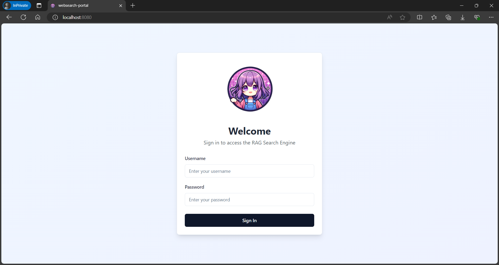
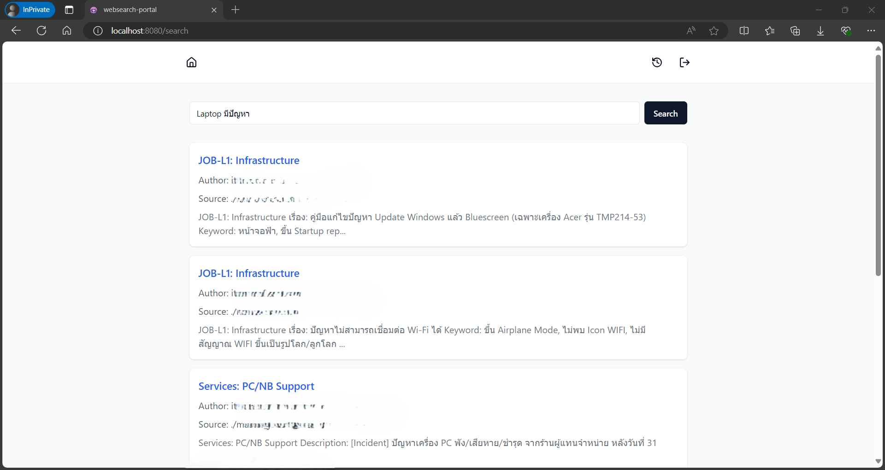

<p align="center">
  
</p>

# RAG Search Engine Web Application

A simple web application for RAG (Retrieval-Augmented Generation) search using MongoDB, Google VertexAI API, and FastAPI backend.
    
## Features

- Clean and elegant user interface
- Secure login system
- Google-like search experience
- Real-time search results with modal view
- Search history tracking
- Responsive design

### Login Page


### Search Page


## Prerequisites

Before you begin, ensure you have the following installed:
- Node.js (v18 or higher)
- Python (v3.9 or higher)
- MongoDB (v6.0 or higher)
- Google Cloud CLI (for VertexAI API access)

## Setup Instructions

### Frontend Setup

1. **Clone the repository:**
   ```bash
   git clone <your-repo-url>
   cd <project-directory>
   ```

2. **Install frontend dependencies:**
   ```bash
   npm install
   ```

3. **Create a `.env` file in the root directory:**
   ```env
   VITE_API_URL=http://localhost:8000
   ```

4. **Start the development server:**
   ```bash
   npm run dev
   ```

   The frontend will be available at `http://localhost:8080`

### Backend Setup

1. **Navigate to the backend directory:**
   ```bash
   cd backend
   ```

2. **Install Poetry:**
   ```bash
   curl -sSL https://install.python-poetry.org | python3 -
   ```

3. **Install Python dependencies using Poetry:**
   ```bash
   poetry install
   ```

4. **Set up environment variables by creating a `.env` file:**
   ```env
   MONGODB_URI=mongodb://localhost:27017/rag_search
   GOOGLE_APPLICATION_CREDENTIALS=path/to/your/credentials.json
   ```

5. **Start the FastAPI server using LangChain serve:**
   ```bash
   langchain serve --port 8101
   ```

   The backend API will be available at `http://localhost:8101`

### Google Cloud Setup

1. **Create a Google Cloud project and enable VertexAI API**
2. **Create a service account and download the credentials JSON file**
3. **Set the path to your credentials in the backend `.env` file**

### MongoDB Setup

1. **Install MongoDB Community Edition**
2. **Start the MongoDB service**
3. **Create a new database named 'rag_search'**

## API Documentation

Once the backend is running, visit `http://localhost:8101/docs` for the complete API documentation.

## Development

- Frontend code is in the `src` directory
- Backend code is in the `backend` directory
- Components use shadcn/ui library
- Styling is done with Tailwind CSS

## Available Scripts

**Frontend:**
```bash
npm run dev        # Start development server
npm run build      # Build for production
npm run preview    # Preview production build
```

**Backend:**
```bash
langchain serve --port 8101    # Start development server
pytest                         # Run tests
```

## Contributing

1. Fork the repository
2. Create a feature branch
3. Commit your changes
4. Push to the branch
5. Create a Pull Request

## License

This project is licensed under the MIT License - see the LICENSE file for details.

## Support

For support, please open an issue in the repository or contact the development team.